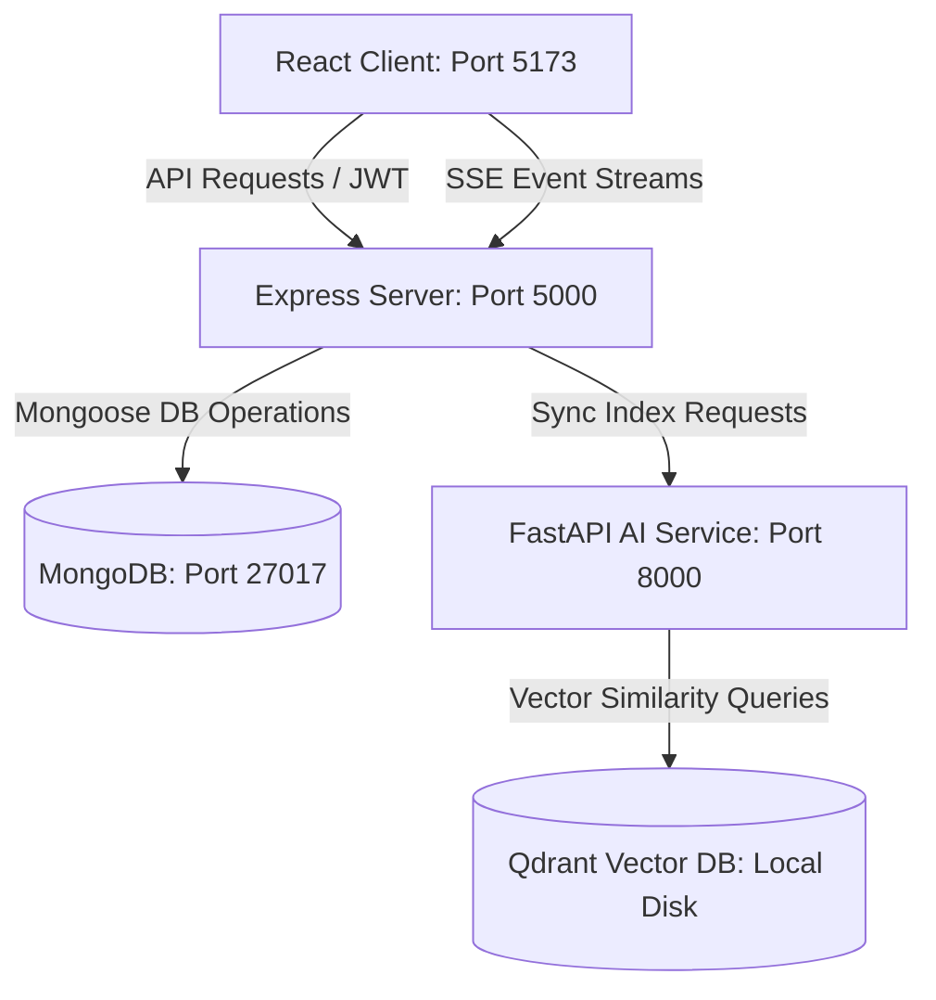

# Insight RAG — Enterprise AI Workspace for Engineering Teams

Insight RAG is a multi-tenant Enterprise AI SaaS platform built for engineering teams. It allows organizations to connect internal tools (GitHub, Slack, Jira) and documents, automatically index workspace files into a vector store, and search across them in a single unified AI interface with inline citations and confidence scoring.

---

## 1. System Architecture

The application is structured into three microservices running natively on the host:



*   **React Frontend (Port 5173)**: Built with React, Redux Toolkit, and Recharts. Connects to Express endpoints and reads SSE streams for ChatGPT-style token-by-token answer printing.
*   **Express Backend (Port 5000)**: Serves as the API gateway. Handles user authentication (JWT access/refresh token rotation), OAuth callback integrations, document file system storage, and database persistence.
*   **Python AI Pipeline (Port 8000)**: Runs FastAPI with local Qdrant. Extracts text from file formats (PDF, DOCX, XLSX, JSON), chunks text, generates embeddings via Gemini API (`text-embedding-004`), and computes BM25 keyword rankings for hybrid retrieval.

---

## 2. Database Schema Model

Insight RAG runs on **MongoDB (Port 27017)**. The collections are designed as follows:

*   **User Schema**: Defines user records, hashed bcrypt credentials, organization ID, and role permissions (`admin` or `employee`).
*   **Org Schema**: Manages organizations, company names, and email domains authorized for self-signup.
*   **Document Schema**: Manages file metadata, file storage paths, source types (`pdf`, `xlsx`, `docx`, `github`, `slack`), and vector indexing states (`processing`, `indexed`, `failed`).
*   **Integration Schema**: Registers connected external connectors, OAuth authentication credentials, and synchronization records.
*   **ChatThread Schema**: Persists employee chat sessions, questions, and synthesized answer summaries.
*   **SearchLog Schema**: Audits employee queries, cited document sources, confidence metrics, and thumbs up/down feedback for quality evaluation.

---

## 3. Core API Reference

### Express Backend Server (Port 5000)

| Endpoint | Method | Role | Description |
| :--- | :--- | :--- | :--- |
| `/api/auth/register` | `POST` | Guest | Registers a new company Organization and Admin user. |
| `/api/auth/login` | `POST` | Guest | Verifies credentials, rotates session tokens. |
| `/api/chat/ask` | `POST` | Employee | SSE Event stream proxy communicating with FastAPI `/ask`. |
| `/api/documents/upload` | `POST` | Admin | Receives file upload, triggers Python indexing worker. |
| `/api/integrations` | `GET` | Admin | Fetches list of active connectors (GitHub, Slack, Jira). |
| `/api/integrations/connect/:source`| `GET` | Admin | Renders HTML OAuth consent popup. |
| `/api/analytics/stats` | `GET` | Admin | Fetches Recharts aggregation metrics. |

### Python AI Engine (Port 8000)

| Endpoint | Method | Description |
| :--- | :--- | :--- |
| `/health` | `GET` | Checks FastAPI status, local Qdrant file lock, and Gemini configuration. |
| `/index` | `POST` | Chunks text, generates vector embeddings, and registers in Qdrant. |
| `/delete-index` | `POST` | Removes document point vectors from Qdrant. |
| `/ask` | `POST` | Performs BM25 + Vector Hybrid search, queries Gemini, streams citations. |

---

## 4. Local Installation & Deployment Guide

This project is built using plain JavaScript and native Python packages for host compatibility.

### Prerequisites
*   Node.js (v16+)
*   Python 3.7.0 (with pip and venv)
*   MongoDB running locally on port 27017

### Installation steps
1.  **Clone the workspace** and open a terminal in the root folder.
2.  **Install root dependencies**:
    ```bash
    npm install
    ```
3.  **Run Development Servers**:
    The root workspace includes a concurrent runner scripts manager. To start the Express server, Vite client, and Python services simultaneously:
    ```bash
    npm run dev
    ```

---

## 5. Security & RBAC Configuration

To satisfy enterprise standards, all admin routes are protected by server-side RBAC middleware (`requireAdmin`). If an employee attempts to query an admin endpoint directly:
1.  The middleware extracts the decrypted JWT payload from the `Authorization: Bearer <token>` header.
2.  Inspects the user's role field in the DB user record.
3.  Blocks the request, returning a `403 Forbidden` status code if the user is not an `admin`.
4.  Logs the event in the server security console.
