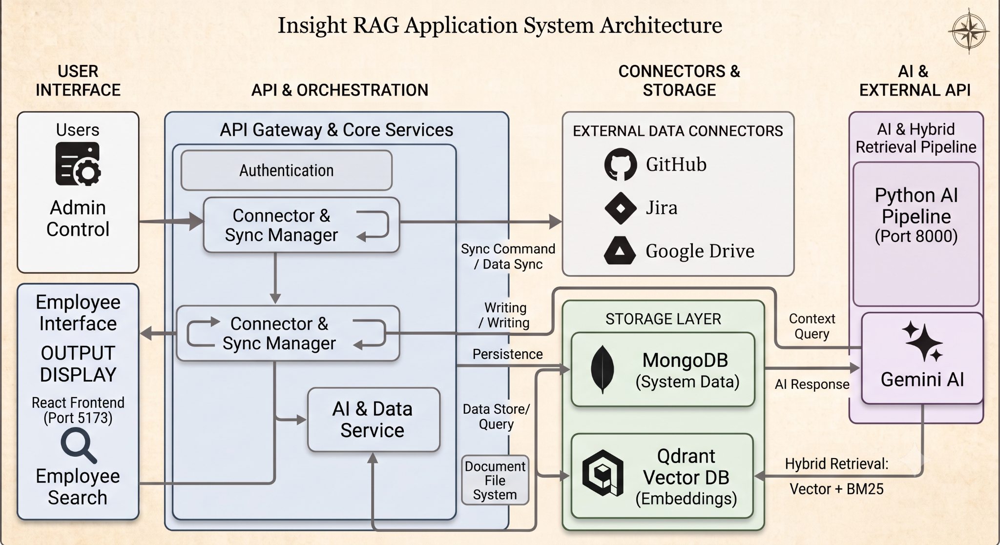

<div align="center">

# Insight RAG

### Enterprise AI Workspace for Engineering Teams

**Connect your team's knowledge. Search everything. Get grounded AI answers.**

[](https://react.dev/)
[](https://nodejs.org/)
[](https://www.python.org/)
[](https://www.mongodb.com/)
[](https://qdrant.tech/)
[](https://fastapi.tiangolo.com/)
[](LICENSE)

<br />

**Insight RAG is a multi-tenant RAG platform that turns scattered engineering knowledge into one searchable AI workspace.**

[Architecture](#-system-architecture) •
[Features](#-key-features) •
[How It Works](#-how-it-works) •
[Tech Stack](#-technology-stack) •
[API](#-api-reference) •
[Security](#-security--rbac) •
[Setup](#-local-development)

</div>

---

## 🚀 What is Insight RAG?

Engineering knowledge is usually spread across repositories, tickets, documents, and internal files.

**Insight RAG brings those sources together.**

Administrators connect organization resources, synchronize and index documents, and make the resulting knowledge available through a unified employee-facing AI search interface.

Instead of manually searching multiple systems, employees can ask questions in natural language and receive AI-generated answers grounded in the organization's indexed knowledge.

### The core idea

```text
┌──────────────────────┐
│  Engineering Teams   │
└──────────┬───────────┘
           │
           ▼
┌──────────────────────┐
│ GitHub / Jira / Drive│
│ Documents & Sources  │
└──────────┬───────────┘
           │ Sync + Index
           ▼
┌──────────────────────┐
│ Hybrid Retrieval     │
│ Vector + BM25        │
└──────────┬───────────┘
           │ Context
           ▼
┌──────────────────────┐
│ Gemini AI            │
└──────────┬───────────┘
           │ Grounded Answer
           ▼
┌──────────────────────┐
│ Employee AI Search   │
└──────────────────────┘
```

---

## ✨ Key Features

| Capability                       | What it does                                                                    |
| -------------------------------- | ------------------------------------------------------------------------------- |
| 🏢 **Multi-Tenant Architecture** | Separates organizations and their data at the application layer.                |
| 🔐 **JWT Authentication**        | Access/refresh token based authentication with token rotation.                  |
| 👥 **Role-Based Access Control** | Separate capabilities for `admin` and `employee` users.                         |
| 🔌 **External Connectors**       | Connect organizational knowledge sources such as GitHub, Jira and Google Drive. |
| 🔄 **Sync Management**           | Synchronizes connected sources and tracks indexing state.                       |
| 📄 **Document Indexing**         | Extracts and processes PDF, DOCX, XLSX and JSON content.                        |
| 🧠 **Hybrid RAG**                | Combines semantic vector retrieval with BM25 keyword search.                    |
| 🔎 **Unified AI Search**         | Employees can query indexed organizational knowledge using natural language.    |
| 🤖 **Gemini AI**                 | Generates answers from retrieved context.                                       |
| ⚡ **Streaming Responses**       | SSE-based token streaming for a ChatGPT-style experience.                       |
| 📊 **Confidence & Feedback**     | Stores confidence metrics, citations and user feedback for evaluation.          |
| 📈 **Admin Analytics**           | Query and usage metrics visualized through Recharts.                            |

---

## 🏗️ System Architecture

<p align="center">
  
</p>

The system is divided into four logical layers:

1. **User Interface**
2. **API & Orchestration**
3. **Connectors & Storage**
4. **AI & Retrieval**


### Architecture at a glance

```text
                    ┌──────────────────────────────┐
                    │       USER INTERFACE         │
                    │                              │
                    │  Admin Control               │
                    │  Employee Search             │
                    │  React + Redux Toolkit       │
                    └──────────────┬───────────────┘
                                   │
                                   ▼
              ┌────────────────────────────────────────┐
              │        API & ORCHESTRATION              │
              │                                        │
              │  Express API Gateway                    │
              │  Authentication / RBAC                 │
              │  Connector & Sync Manager              │
              │  AI & Data Service                     │
              └──────────────┬───────────────┬─────────┘
                             │               │
                ┌────────────▼───────┐       │
                │ External Connectors│       │
                │                    │       │
                │ GitHub             │       │
                │ Jira               │       │
                │ Google Drive       │       │
                └────────────┬───────┘       │
                             │               │
                             ▼               ▼
                  ┌─────────────────┐  ┌─────────────────┐
                  │     MongoDB     │  │     Qdrant      │
                  │   System Data   │  │   Embeddings    │
                  └─────────────────┘  └────────┬────────┘
                                                │
                                                ▼
                                    ┌─────────────────────┐
                                    │ Hybrid Retrieval    │
                                    │                     │
                                    │ Vector Search       │
                                    │       +             │
                                    │ BM25 Keyword Search │
                                    └──────────┬──────────┘
                                               │
                                               ▼
                                    ┌─────────────────────┐
                                    │     Gemini AI       │
                                    │ Context → Answer    │
                                    └──────────┬──────────┘
                                               │
                                               ▼
                                    ┌─────────────────────┐
                                    │ Streaming Response  │
                                    │ + Citations         │
                                    └─────────────────────┘
```

---

# 🧩 Microservices

Insight RAG runs as three primary services.

### 1. React Frontend — `Port 5173`

Responsible for the employee and admin experience.

**Responsibilities**

- React-based UI
- Redux Toolkit state management
- Employee AI search interface
- Admin controls
- Connector management
- Analytics dashboards
- SSE response streaming
- Chat/thread experience

---

### 2. Express Backend — `Port 5000`

Acts as the application's API gateway and orchestration layer.

**Responsibilities**

- User registration and authentication
- JWT access/refresh token handling
- Role-based authorization
- OAuth callback integrations
- Document upload and file storage
- MongoDB persistence
- Connector and synchronization management
- Proxying AI requests
- Analytics APIs

---

### 3. Python AI Pipeline — `Port 8000`

The retrieval and generation engine built with FastAPI.

**Responsibilities**

- Document parsing
- Text extraction
- Chunk generation
- Gemini embedding generation
- Qdrant vector indexing
- BM25 keyword retrieval
- Hybrid ranking
- Context construction
- Gemini response generation
- Citation streaming

---

# 🧠 How Insight RAG Works

## 1. Connect

An administrator connects organizational knowledge sources.

```text
Admin
  │
  ├── GitHub
  ├── Jira
  └── Google Drive
```

The backend manages connector configuration, authentication and synchronization.

---

## 2. Ingest

Documents are downloaded or uploaded and processed by the AI pipeline.

```text
Document
   ↓
Text Extraction
   ↓
Cleaning / Normalization
   ↓
Chunking
   ↓
Embedding Generation
   ↓
Qdrant Index
```

Supported document formats include:

- PDF
- DOCX
- XLSX
- JSON

---

## 3. Retrieve

When an employee asks a question, Insight RAG performs **hybrid retrieval**.

```text
                  User Query
                      │
              ┌───────┴────────┐
              ▼                ▼
       Vector Retrieval      BM25
       Semantic Search    Keyword Search
              │                │
              └───────┬────────┘
                      ▼
                Hybrid Ranking
                      │
                      ▼
               Relevant Context
```

### Why hybrid retrieval?

Vector search is strong at understanding **meaning and semantic similarity**.

BM25 is strong at matching **exact terms, names, identifiers and keywords**.

Combining both helps retrieve relevant information across different types of engineering knowledge.

---

## 4. Generate

The retrieved context is passed to Gemini.

```text
User Question
      +
Retrieved Context
      ↓
   Gemini AI
      ↓
Grounded Answer
      +
Citations / Confidence
```

The backend streams the response to the React frontend using **Server-Sent Events (SSE)**.

---

# 🗄️ Data Model

MongoDB stores application and organizational metadata.

### User

```text
User
├── credentials
├── organizationId
├── role
└── authentication metadata
```

Roles:

```text
admin
employee
```

### Organization

```text
Organization
├── companyName
└── authorizedEmailDomain
```

### Document

```text
Document
├── metadata
├── storagePath
├── sourceType
├── organizationId
└── indexingStatus
```

Indexing states:

```text
processing → indexed
     │
     └──────→ failed
```

### Integration

Stores:

- Connected source
- OAuth credentials
- Synchronization information
- Connector state

### ChatThread

Stores employee conversations, questions and synthesized answer summaries.

### SearchLog

Provides an audit/evaluation trail containing:

- Employee queries
- Cited sources
- Confidence metrics
- Feedback

---

# 🔐 Security & RBAC

Security is enforced on the backend rather than relying only on frontend restrictions.

### Request flow

```text
Client Request
      │
      ▼
Authorization Header
Bearer <JWT>
      │
      ▼
JWT Validation
      │
      ▼
User / Role Verification
      │
      ├── admin ──────► Admin Endpoint
      │
      └── employee ──► 403 Forbidden
```

Admin routes are protected using server-side `requireAdmin` middleware.

If an employee attempts to directly access an administrative endpoint:

```text
Employee
   ↓
Admin API
   ↓
requireAdmin
   ↓
Role Check
   ↓
403 Forbidden
```

This ensures authorization is enforced at the API boundary and cannot be bypassed simply by modifying the frontend.

---

# 🛠️ Technology Stack

### Frontend

- React
- Vite
- Redux Toolkit
- Recharts
- SSE

### Backend

- Node.js
- Express.js
- MongoDB
- Mongoose
- JWT
- bcrypt
- OAuth integrations

### AI / Retrieval

- Python
- FastAPI
- Gemini API
- Gemini `text-embedding-004`
- Qdrant
- BM25
- Hybrid Retrieval

### Development

- Git
- npm
- Python `venv`
- Native host-based services

---

# 🔌 API Reference

## Express Backend — `Port 5000`

| Endpoint                            | Method | Access   | Purpose                                        |
| ----------------------------------- | -----: | -------- | ---------------------------------------------- |
| `/api/auth/register`                | `POST` | Guest    | Creates an organization and initial admin user |
| `/api/auth/login`                   | `POST` | Guest    | Authenticates user and rotates session tokens  |
| `/api/chat/ask`                     | `POST` | Employee | Proxies AI query and streams response via SSE  |
| `/api/documents/upload`             | `POST` | Admin    | Uploads document and triggers indexing         |
| `/api/integrations`                 |  `GET` | Admin    | Lists active connectors                        |
| `/api/integrations/connect/:source` |  `GET` | Admin    | Starts OAuth connection flow                   |
| `/api/analytics/stats`              |  `GET` | Admin    | Returns analytics aggregation data             |

---

## Python AI Engine — `Port 8000`

| Endpoint        | Method | Purpose                                                 |
| --------------- | -----: | ------------------------------------------------------- |
| `/health`       |  `GET` | Checks AI service, Qdrant and Gemini configuration      |
| `/index`        | `POST` | Chunks content, creates embeddings and indexes vectors  |
| `/delete-index` | `POST` | Removes document vectors from Qdrant                    |
| `/ask`          | `POST` | Performs hybrid retrieval and generates the AI response |

---

# ⚡ Quick Start

## Prerequisites

Make sure you have:

- Node.js `16+`
- Python `3.7+`
- npm
- MongoDB running on `27017`
- Gemini API credentials

---

## 1. Clone the repository

```bash
git clone https://github.com/SayyadShekshavali/Insight-RAG.git
cd Insight-RAG
```

## 2. Install Node dependencies

```bash
npm install
```

## 3. Configure environment variables

Create the required environment files and add your MongoDB, JWT, OAuth and Gemini configuration.

Example:

```env
MONGODB_URI=mongodb://localhost:27017/insight-rag
GEMINI_API_KEY=your_gemini_api_key
JWT_SECRET=your_secret
```

> Keep secrets out of Git. Add your environment files to `.gitignore`.

## 4. Start the application

The root workspace includes a concurrent development runner:

```bash
npm run dev
```

The services run on:

```text
React       → http://localhost:5173
Express     → http://localhost:5000
FastAPI     → http://localhost:8000
MongoDB     → localhost:27017
```

---

# 📁 Project Structure

```text
Insight-RAG/
│
├── frontend/
│   ├── components/
│   ├── pages/
│   ├── redux/
│   └── ...
│
├── backend/
│   ├── controllers/
│   ├── middleware/
│   ├── models/
│   ├── routes/
│   ├── services/
│   └── ...
│
├── ai/
│   ├── ingestion/
│   ├── retrieval/
│   ├── embeddings/
│   ├── services/
│   └── ...
│
├── docs/
│   └── architecture.png
│
├── package.json
└── README.md
```

> Adjust the directory names above if your current repository uses a different folder structure.

---

# 🎯 Design Goals

Insight RAG is designed around a few principles:

### 🔎 One search surface

Employees should not need to know where information lives before asking a question.

### 🧠 Retrieval before generation

The system retrieves organization-specific context before asking the LLM to generate an answer.

### 🏢 Tenant-aware architecture

Organization identity is carried through application data and access-control boundaries.

### 🔐 Backend-enforced permissions

Authorization decisions happen server-side.

### ⚡ Responsive AI experience

SSE streaming provides incremental answers instead of waiting for the complete generation.

### 📊 Measurable search quality

Search logs, citations, confidence metrics and feedback provide data for evaluating retrieval quality.

---

# 🧪 Example Query Flow

**Employee asks:**

> "What was the decision made about the authentication service?"

Insight RAG:

```text
Employee Question
       ↓
Express /api/chat/ask
       ↓
FastAPI /ask
       ↓
 ┌───────────────┐
 │ Hybrid Search │
 └───────┬───────┘
         │
    ┌────┴─────┐
    ▼          ▼
 Qdrant      BM25
    │          │
    └────┬─────┘
         ▼
 Relevant Documents
         ↓
 Context Construction
         ↓
 Gemini AI
         ↓
 SSE Stream
         ↓
 React Employee UI
```

The result is an AI response grounded in the organization's indexed information, with source references and confidence information available for evaluation.

---

# 📈 Why This Architecture?

Insight RAG separates **application logic**, **data management**, and **AI retrieval/generation** into focused services.

This makes the system easier to:

- Develop independently
- Scale AI workloads separately
- Replace or improve retrieval strategies
- Add new connectors
- Protect admin operations
- Monitor search quality
- Evolve the AI pipeline without tightly coupling it to the frontend

---

# 🗺️ Future Improvements

Potential extensions include:

- Slack connector
- Additional enterprise connectors
- Background job queues for large-scale indexing
- Incremental synchronization
- Advanced reranking models
- Fine-grained document permissions
- Distributed Qdrant deployment
- Observability and tracing
- Automated retrieval evaluation
- Production containerization and orchestration

---

# 👨‍💻 Built By

**Sayyad Shekshavali**

Software Engineer focused on **Full-Stack Development, AI/ML, RAG systems and Generative AI**.

- GitHub: [SayyadShekshavali](https://github.com/SayyadShekshavali)
- Project: [Insight-RAG](https://github.com/SayyadShekshavali/Insight-RAG)

---

<div align="center">

### ⭐ If Insight RAG is useful or interesting, consider giving the repository a star.

**Built to make enterprise knowledge easier to find, understand, and use.**

</div>
